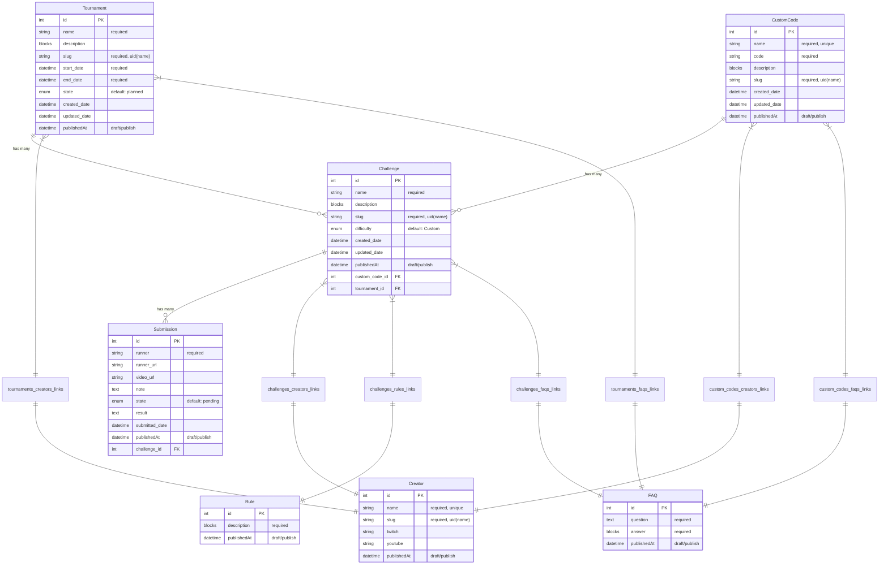

# Object Relation Model (ORM)

This document provides a comprehensive visualization of the TLD Challenges backend data model, showing all content types, their fields, relationships, and constraints.

## Entity Relationship Diagram



## Detailed Content Type Specifications

### Challenge
**Purpose**: Core challenge definitions with rules, custom codes, and metadata.

**Fields**:
- `name` (Text, required) - Display name of the challenge
- `description` (Rich text/Blocks) - Formatted challenge description
- `slug` (UID, targetField: name, required) - URL-friendly identifier
- `difficulty` (Enumeration, default: "Custom") - Game difficulty level
  - Options: "Pilgrim", "Voyager", "Stalker", "Interloper", "Misery", "Nogoa", "Custom"
- `created_date` (Date and time) - Challenge creation timestamp
- `updated_date` (Date and time) - Last modification timestamp

**Relations**:
- `submissions` (One to Many → Submission) - Anonymous user submissions for this challenge
- `custom_code` (Many to One → CustomCode) - Associated game configuration code
- `tournament` (Many to One → Tournament) - Parent tournament (challenges belong to one tournament)
- `creators` (Many to Many ↔ Creator) - Challenge creators/authors
- `rules` (Many to Many ↔ Rule) - Associated rule definitions
- `faqs` (Many to Many ↔ FAQ) - Related frequently asked questions

**Features**: Draft/Publish enabled

---

### Submission
**Purpose**: Anonymous user run submissions with validation, external media links, and moderation workflow.

**Fields**:
- `runner` (Text, required) - Submitter's display name
- `runner_url` (Text) - Optional link to runner's profile (Twitch/YouTube)
- `video_url` (Text) - Link to submission video/proof
- `note` (Text) - Additional submission notes or comments
- `state` (Enumeration, default: "pending") - Moderation status
  - Options: "pending", "approved", "rejected"
- `result` (Text) - Run result/time/score
- `submitted_date` (Date and time) - Submission timestamp

**Relations**:
- `challenge` (Many to One → Challenge) - Associated challenge

**Features**: Draft/Publish enabled for moderation workflow

---

### Tournament
**Purpose**: Tournament structures and participant management.

**Fields**:
- `name` (Text, required) - Tournament name
- `description` (Rich text/Blocks) - Tournament description and rules
- `slug` (UID, targetField: name, required) - URL-friendly identifier
- `start_date` (Date and time, required) - Tournament start date
- `end_date` (Date and time, required) - Tournament end date
- `state` (Enumeration, default: "planned") - Tournament status
  - Options: "planned", "active", "completed", "cancelled"
- `created_date` (Date and time) - Tournament creation timestamp
- `updated_date` (Date and time) - Last modification timestamp

**Relations**:
- `challenges` (One to Many ← Challenge) - Tournament challenges
- `creators` (Many to Many ↔ Creator) - Tournament organizers
- `faqs` (Many to Many ↔ FAQ) - Tournament-specific FAQs

**Features**: Draft/Publish enabled

---

### CustomCode
**Purpose**: Reusable custom game configuration codes.

**Fields**:
- `name` (Text, required, unique) - Unique identifier name
- `code` (Text, required) - The actual custom game code
- `description` (Rich text/Blocks) - Code description and usage instructions
- `slug` (UID, targetField: name, required) - URL-friendly identifier
- `created_date` (Date and time) - Code creation timestamp
- `updated_date` (Date and time) - Last modification timestamp

**Relations**:
- `challenges` (One to Many ← Challenge) - Challenges using this code
- `creators` (Many to Many ↔ Creator) - Code creators/contributors
- `faqs` (Many to Many ↔ FAQ) - Code-related FAQs

**Features**: Draft/Publish enabled

---

### Rule
**Purpose**: Modular rule definitions for challenges.

**Fields**:
- `description` (Rich text/Blocks, required) - Rule description and details

**Relations**:
- `challenges` (Many to Many ↔ Challenge) - Associated challenges

**Features**: Draft/Publish enabled

---

### Creator
**Purpose**: Challenge creator profiles with social media links.

**Fields**:
- `name` (Text, required, unique) - Creator's display name
- `slug` (UID, targetField: name, required) - URL-friendly identifier
- `twitch` (Text) - Twitch channel URL
- `youtube` (Text) - YouTube channel URL

**Relations**:
- `challenges` (Many to Many ↔ Challenge) - Created/contributed challenges
- `tournaments` (Many to Many ↔ Tournament) - Organized tournaments
- `custom_codes` (Many to Many ↔ CustomCode) - Created custom codes

**Features**: Draft/Publish enabled

---

### FAQ
**Purpose**: Frequently asked questions with multi-entity associations.

**Fields**:
- `question` (Text, required) - The question text
- `answer` (Rich text/Blocks, required) - Formatted answer with rich content

**Relations**:
- `challenges` (Many to Many ↔ Challenge) - Challenge-related FAQs
- `custom_codes` (Many to Many ↔ CustomCode) - Custom code FAQs
- `tournaments` (Many to Many ↔ Tournament) - Tournament-specific FAQs

**Features**: Draft/Publish enabled

## Database Schema Implementation

### Junction Tables (Many-to-Many Relations)

```sql
-- Challenge-Creator associations
challenges_creators_links (
    id SERIAL PRIMARY KEY,
    challenge_id INTEGER REFERENCES challenges(id),
    creator_id INTEGER REFERENCES creators(id),
    challenge_order DECIMAL,
    creator_order DECIMAL
);

-- Challenge-Rule associations  
challenges_rules_links (
    id SERIAL PRIMARY KEY,
    challenge_id INTEGER REFERENCES challenges(id),
    rule_id INTEGER REFERENCES rules(id),
    challenge_order DECIMAL,
    rule_order DECIMAL
);

-- Challenge-FAQ associations
challenges_faqs_links (
    id SERIAL PRIMARY KEY,
    challenge_id INTEGER REFERENCES challenges(id),
    faq_id INTEGER REFERENCES faqs(id),
    challenge_order DECIMAL,
    faq_order DECIMAL
);

-- Tournament-Creator associations
tournaments_creators_links (
    id SERIAL PRIMARY KEY,
    tournament_id INTEGER REFERENCES tournaments(id),
    creator_id INTEGER REFERENCES creators(id),
    tournament_order DECIMAL,
    creator_order DECIMAL
);

-- Tournament-FAQ associations
tournaments_faqs_links (
    id SERIAL PRIMARY KEY,
    tournament_id INTEGER REFERENCES tournaments(id),
    faq_id INTEGER REFERENCES faqs(id),
    tournament_order DECIMAL,
    faq_order DECIMAL
);

-- CustomCode-Creator associations
custom_codes_creators_links (
    id SERIAL PRIMARY KEY,
    custom_code_id INTEGER REFERENCES custom_codes(id),
    creator_id INTEGER REFERENCES creators(id),
    custom_code_order DECIMAL,
    creator_order DECIMAL
);

-- CustomCode-FAQ associations
custom_codes_faqs_links (
    id SERIAL PRIMARY KEY,
    custom_code_id INTEGER REFERENCES custom_codes(id),
    faq_id INTEGER REFERENCES faqs(id),
    custom_code_order DECIMAL,
    faq_order DECIMAL
);
```

### Foreign Key Relations (Many-to-One)

```sql
-- Direct foreign key columns
challenges.custom_code_id → custom_codes.id
challenges.tournament_id → tournaments.id  
submissions.challenge_id → challenges.id
```

## API Query Patterns

### Common Population Strategies

```javascript
// Get challenge with all related content
const challenge = await strapi.entityService.findOne('api::challenge.challenge', id, {
  populate: {
    custom_code: true,
    tournament: true,
    creators: true,
    rules: true,
    faqs: true,
    submissions: {
      filters: { 
        publishedAt: { $notNull: true },
        state: 'approved'
      }
    }
  }
});

// Get tournament with challenges and metadata
const tournament = await strapi.entityService.findOne('api::tournament.tournament', id, {
  populate: {
    challenges: {
      populate: ['creators', 'custom_code', 'rules']
    },
    creators: true,
    faqs: true
  }
});

// Get creator with all contributions
const creator = await strapi.entityService.findOne('api::creator.creator', id, {
  populate: {
    challenges: {
      populate: ['tournament', 'custom_code']
    },
    tournaments: true,
    custom_codes: true
  }
});
```

### Filtering and Sorting Examples

```javascript
// Get challenges by difficulty
const challenges = await strapi.entityService.findMany('api::challenge.challenge', {
  filters: {
    difficulty: 'Interloper',
    publishedAt: { $notNull: true }
  },
  populate: ['creators', 'custom_code', 'tournament']
});

// Get approved submissions for leaderboard
const submissions = await strapi.entityService.findMany('api::submission.submission', {
  filters: {
    state: 'approved',
    publishedAt: { $notNull: true },
    challenge: { id: challengeId }
  },
  sort: ['submitted_date:desc'],
  populate: ['challenge']
});

// Get active tournaments with challenge count
const tournaments = await strapi.entityService.findMany('api::tournament.tournament', {
  filters: {
    state: 'active',
    publishedAt: { $notNull: true }
  },
  populate: {
    challenges: {
      filters: { publishedAt: { $notNull: true } }
    }
  }
});
```

## Constraints and Validation

### Unique Constraints
- `Creator.name` - Prevents duplicate creator names
- `CustomCode.name` - Ensures unique custom code identifiers
- `Challenge.slug` - URL-friendly unique identifiers
- `Tournament.slug` - URL-friendly unique identifiers
- `Creator.slug` - URL-friendly unique identifiers
- `CustomCode.slug` - URL-friendly unique identifiers

### Required Fields
- All `name` fields in primary entities
- `Challenge.slug`, `Tournament.slug`, `Creator.slug`, `CustomCode.slug`
- `Tournament.start_date` and `end_date`
- `CustomCode.code`
- `Rule.description`
- `FAQ.question` and `FAQ.answer`
- `Submission.runner`

### Enumeration Constraints
- `Challenge.difficulty`: Limited to predefined difficulty levels
- `Submission.state`: Enforces moderation workflow states  
- `Tournament.state`: Manages tournament lifecycle

### Draft/Publish Workflow
All content types support the draft/publish workflow:
- Content starts as drafts (not visible in public API)
- Admin approval required for publishing
- `publishedAt` field controls visibility
- Enables content moderation and quality control

## Performance Considerations

### Indexing Strategy
```sql
-- Recommended indexes for query performance
CREATE INDEX idx_challenges_difficulty ON challenges(difficulty);
CREATE INDEX idx_challenges_tournament ON challenges(tournament_id);
CREATE INDEX idx_challenges_custom_code ON challenges(custom_code_id);
CREATE INDEX idx_submissions_challenge ON submissions(challenge_id);
CREATE INDEX idx_submissions_state ON submissions(state);
CREATE INDEX idx_tournaments_state ON tournaments(state);
CREATE INDEX idx_published_content ON challenges(published_at);
```

### Query Optimization
- Use selective population to avoid over-fetching
- Filter by `publishedAt` to exclude drafts in public APIs
- Implement pagination for large result sets
- Cache frequently accessed content (tournaments, custom codes)

## Security Model

### Content Access Control
- **Public API**: Only published content visible
- **Admin API**: Full access to drafts and published content
- **Anonymous Submissions**: Direct creation allowed, starts as draft
- **Moderation Required**: All content requires admin approval before public visibility

### Data Integrity
- Foreign key constraints prevent orphaned records
- Unique constraints prevent duplicate identifiers
- Required field validation ensures data completeness
- Enumeration constraints maintain data consistency
